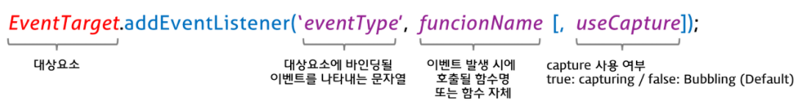
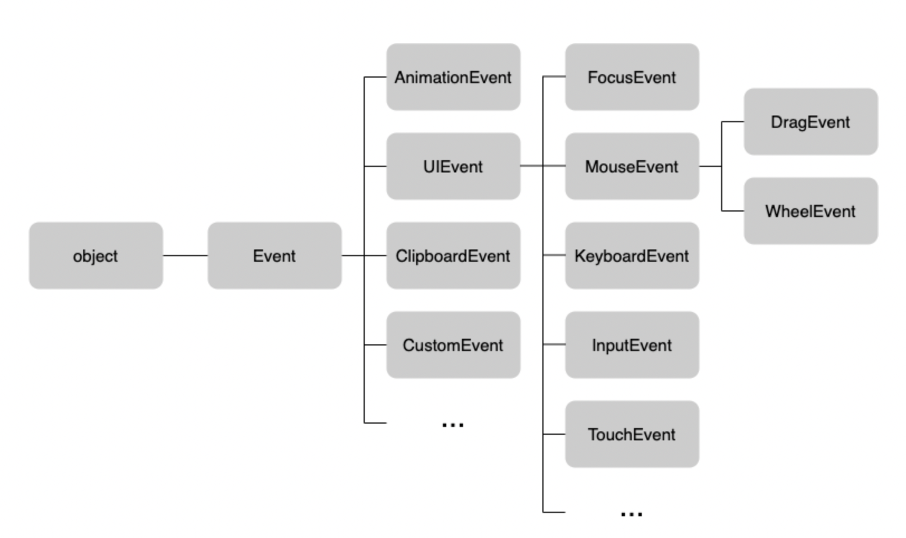

# DIL: 모던 자바스크립트 Deep Dive

> 스터디: 월간 CS, https://github.com/monthly-cs/2024-07-modern-javascript-deep-dive  
> 작성일: 2024-09-27
> 작성자: jrary

---

# 40장 이벤트

## 40.1 이벤트 드리븐 프로그래밍

- 클릭, 키보드 입력, 마우스 이동 등이 일어나면 브라우저는 이를 감지하여 이벤트를 발생시킨다.
- 이벤트가 발생했을 때 호출될 함수를 이벤트 핸들러라 한다.

```html
<script>
    const $button = document.querySelector('button');
    $button.onclick = () => { alert('button click'); };
</script>
```

- `$button`의 onclick 프로퍼티에 함수를 할당한다.
- 이처럼 이벤트와 이벤트 핸들러를 통해 사용자와 애플리케이션은 상호작용을 할 수 있다.
- 프로그램의 흐름을 이벤트 중심으로 제어하는 프로그래밍 방식을 이벤트 드리븐 프로그래밍이라 한다.

## 40.2 이벤트 타입

- 이벤트 타입은 이벤트의 종류를 나타내는 문자열이다.

### 40.2.1 마우스 이벤트 

| 이벤트 타입 | 이벤트 발생 시점 |
| --- | --- |
| click | 마우스 버튼을 클릭했을 때 |
| dbclick | 마우스 버튼을 더블 클릭했을 때 |
| mousedown | 마우스 버튼을 눌렀을 때 |
| mouseup | 누르고 있던 마우스 버튼을 놓았을 때 |
| mousemove | 마우스 커서를 움직였을 때 |
| mouseenter | 마우스 커서를 HTML 요소 안으로 이동했을 떄 (버블링되지 않는다)|
| mouseover | 마우스 커서를 HTML 요소 안으로 이동했을 때 (버블링된다) |
| mouseleave | 마우스 커서를 HTML 요소 밖으로 이동했을 때 (버블링되지 않는다)|
| mouseout | 마우스 커서를 HTML 요소 밖으로 이동했을 때 (버블링된다) |

## 40.3 이벤트 핸들러 등록

- 함수 호출을 브라우저에게 위임하는 것

### 40.3.1 이벤트 핸들러 어트리뷰트 방식

- 이벤트 핸들러 어트리뷰트 값으로 함수 호출문 등의 문을 할당하면 이벤트 핸들러가 등록된다.
- 함수 참조 (함수 호출문 x) 를 등록해야 브라우저가 이벤트 핸들러를 호출할 수 있다.

```html
<button onclick="sayHi('Lee')">Click me!</button>
<script>
    function sayHi(name) {
        console.log(`Hi! ${name}`)
    }
</script>
```

- 이벤트 핸들러 어트리뷰트 값으로 함수 호출문을 할당하는 예시

```js
function onclick(event) {
    sayHi('Lee')
}
```

- `onclick="sayHi('Lee')"` 라는 어트리뷰트는 파싱되어 함수를 암묵적으로 생성하고, 이벤트 핸들러 어트리뷰트 이름과 동일한 키 onclick 이벤트 핸들러 프로퍼티에 할당한다.

```html
<button onclick="sayHi">Click me!</button>
```

- 인수를 전달하기 힘들어짐.
- 따라서, 이벤트 핸들러 어트리뷰트 값으로 할당한 문자열은 암묵적으로 생성되는 이벤트 핸들러의 함수 몸체다.

### 40.3.2 이벤트 핸들러 프로퍼티 방식

- 이벤트 핸들러 프로퍼티에 함수를 바인딩하면 이벤트 핸들러가 등록된다.
- 이벤트 핸들러를 등록하기 위해서는 이벤트 타깃, 이벤트 타입, 이벤트 핸들러를 지정해야 한다.

```js
// $button: 이벤트 타깃
// on + 이벤트 타입
// function: 이벤트 핸들러
$button.onclick = function () {
  console.log('button click')
}
```

- 이벤트 핸들러 프로퍼티에 하나의 이벤트 핸들러만 바인딩할 수 있다는 단점이 있다.

### 40.3.3 addEventListener 메서드 방식



- 이벤트 타입: 이벤트의 종류를 나타내는 문자열
- 이벤트 핸들러: 
- capture 사용 여부: 이벤트 전파 단계

## 40.4 이벤트 핸들러 제거

- `EventTarget.prototype.removeEventListener` 메서드 사용

```js
$button.addEventListener('click', handleClick)

// 위에서 추가할 때 메서드에 전달한 인수와 일치하도록 해야 한다.
$button.removeEventListener('click', handleClick, true) // X
$button.removeEventListener('click', handleClick) // O
```

## 40.5 이벤트 객체

- 이벤트에 관련한 다양한 정보를 담고 있는 객체
- 생성된 이벤트 객체는 이벤트 핸들러의 첫 번째 인수로 전달됨

```html
<em class="message"></em>
<script>
    const $msg = document.querySelector('.message')
    // 클릭 이벤트에 의해 생성된 이벤트 객체
    function showCoords(e) {
        $msg.textContent = `clientX: ${e.clientX}, clientY: ${e.clientY}`;
    }
    document.onclick = showCoords;
</script>
```

- 이벤트 객체는 암묵적으로 e에 할당된다.

### 40.5.1 이벤트 객체의 상속 구조



- 위의 Event, UIEvent, MouseEvent 등 모두가 생성자 함수이다.
- new 연산자와 함께 생성자 함수를 호출하면 이벤트 객체를 생성할 수 있다.

```js
let e = new Event('foo');
console.log(e.type);  // foo
console.log(e instanceOf Event);  // true
console.log(e instanceOf Object);  // true

e = new FocusEvent('focus');
e = new MouseEvent('click');
e = new KeyboardEvent('keyup');
e = new InputEvent('change');
```

이벤트가 발생하면 암묵적으로 생성되는 이벤트 객체도 생성자 함수에 의해 생성된다.

생성된 이벤트 객체는 생성자 함수와 더불어 생성되는 프로토타입으로 구성된 프로토타입 체인의 일원이 된다.

이벤트 객체의 프로퍼티는 발생한 이벤트의 타입에 따라 달라진다.

```html
<!DOCTYPE html>
<html>
  <body>
    <input type="text" />
    <input type="checkbox" />
    <button>Click me!</button>
    <script>
      const $input = document.querySelector('input[type=text]');
      const $checkbox = document.querySelector('input[type=checkbox]');
      const $button = document.querySelector('button');

      // load 이벤트 발생 -> Event 타입의 이벤트 객체 생성
      window.onload = console.log;

      // change 이벤트 -> Event 타입의 이벤트 객체 생성
      $checkbox.onchange = console.log;

      // focus 이벤트 -> FocusEvent 타입의 이벤트 객체 생성
      $input.onfocus = console.log;

      // input 이벤트 -> InputEvent 타입의 이벤트 객체 생성
      $input.oninput = console.log;

      // keyup 이벤트 -> KeyboardEvent 타입의 이벤트 객체 생성
      $input.onkeyup = console.log;

      // click 이벤트 -> MouseEvent 타입의 이벤트 객체 생성
      $button.onclick = console.log;
    </script>
  </body>
</html>
```

### 40.5.2 이벤트 객체의 공통 프로퍼티

### 40.5.3 마우스 정보 취득

- click, dbclick, mousedown, mouseup, mouseenterm mouseleave 이벤트가 발생하면 생성되는 MouseEvent
- 마우스 포인터의 좌표 정보를 나타내는 프로퍼티, 버튼 정보를 나타내는 프로퍼티를 갖는다.

### 40.5.4 키보드 정보 취득

- keydown, keyup, keypress 이벤트가 발생하면 생성되는 KeyboardEvent
- 입력한 키 값을 문자열로 반환하는 key 프로퍼티를 제공한다.
