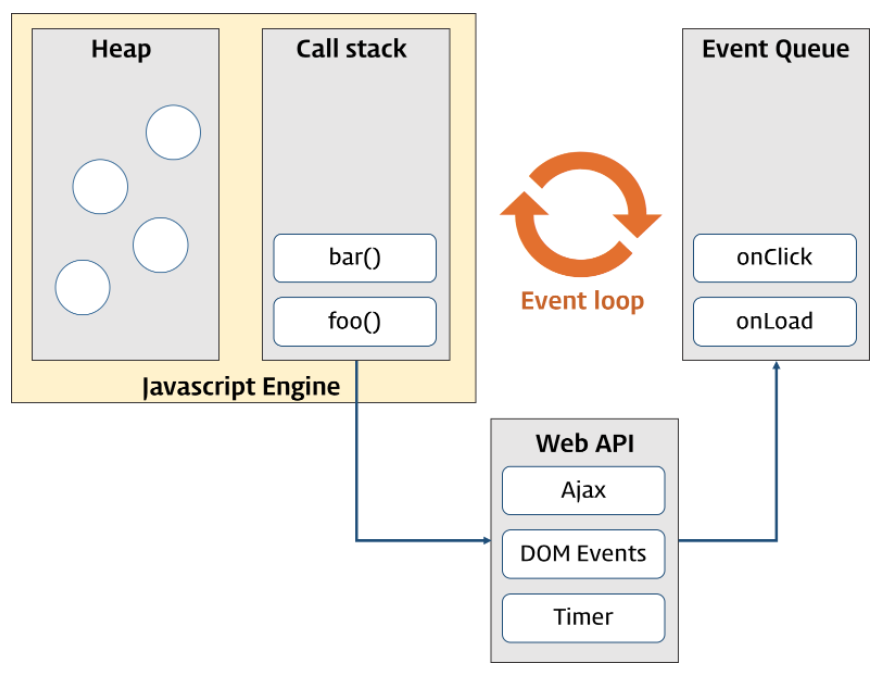

# DIL: 모던 자바스크립트 Deep Dive

> 스터디: 월간 CS, https://github.com/monthly-cs/2024-07-modern-javascript-deep-dive  
> 작성일: 2024-10-01
> 작성자: jrary

---

# 42장 비동기 프로그래밍

## 42.1 동기 처리와 비동기 처리

```jsx
const foo = () => {};
const bar = () => {};

foo();
bar();
```

- 함수 실행 컨텍스트는 실행 컨텍스트 스택에 푸시되고 함수 코드가 실행된다.
- foo 함수와 bar 함수는 호출된 순서대로 스택 자료구조인 실행 컨텍스트 스택에 푸시되어 실행된다.
- 자바스크립트 엔진은 단 하나의 실행 컨텍스트 스택을 갖는다. = 함수를 실행할 수 있는 창구가 단 하나이며 동시에 2개 이상의 함수를 실행시킬 수 없다는 것을 의미한다.
- 자바스크립트 엔진은 한 번에 하나의 태스크만 실행할 수 있는 싱글 스레드 방식으로 동작한다.
- 따라서 처리에 시간이 걸리는 태스크를 실행하는 경우 블로킹(작업 중단)이 발생한다.

## 42.2 이벤트 루프와 태스크 큐



- 자바스크립트의 동시성을 지원하는 것이 이벤트 루프이다.
- 콜 스택: 소스코드 평가 과정에서 생성된 실행 컨텍스트가 추가되고 제거되는 스택 자료구조인 실행 컨텍스트 스택. 함수를 호출하면 함수 실행 컨텍스트가 순차적으로 콜 스택에 푸시되어 순차적으로 실행된다.
- 힙: 객체가 저장되는 메모리 공간


- 비동기 함수인 `setTimeout`의 콜백 함수는 태스크 큐에 푸시되어 대기하다가 콜 스택이 비게 되면 콜 스택에 푸시되어 실행된다.

# 43장 Ajax

## 43.1 Ajax란?

- js를 사용하여 브라우저가 서버에게 비동기 방식으로 데이터를 요청하고, 서버가 응답한 데이터를 수신하여 웹페이지를 동적으로 갱신하는 프로그래밍 방식

1. 변경할 부분을 갱신하는 데 필요한 데이터만 부른다
2. 변경할 필요가 없는 부분은 다시 렌더링하지 않는다.
3. 클라이언트와 서버와의 통신이 비동기적으로 동작한다.

## 43.3 XMLHttpRequest

- 자바스크립트를 사용하여 HTTP request를 전송하기 위한 객체

### 43.3.1 XMLHttpRequest 객체 생성

```jsx
const xhr = new XMLHttpRequest();
```

### 43.3.3 HTTP 요청 전송

1. XMLHttpRequest.prototype.open 메서드로 HTTP 요청을 초기화한다
2. 필요에 따라 XMLHttprequest.prototype.setRequestHeader 메서드로 특정 HTTP 요청의 헤더 값을 설정한다
3. XMLHttpRequest.prototype.send 메서드로 HTTP 요청을 전송한다.

```jsx
```