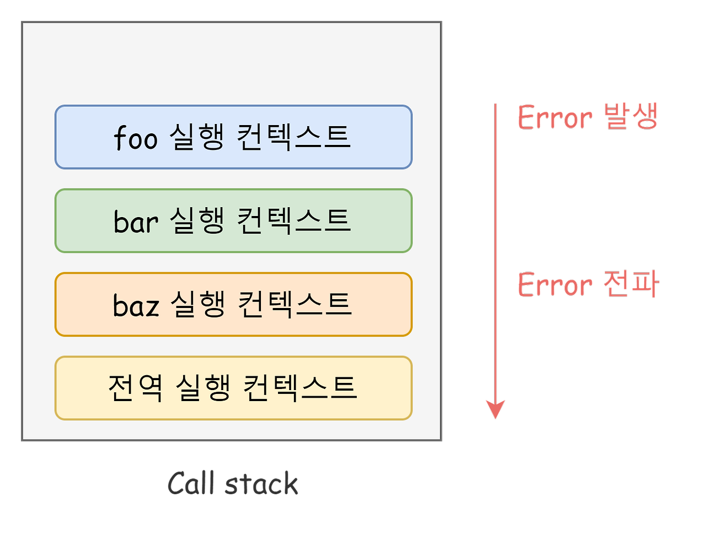

# DIL: 모던 자바스크립트 Deep Dive

> 스터디: 월간 CS, https://github.com/monthly-cs/2024-07-modern-javascript-deep-dive  
> 작성일: 2024-10-12
> 작성자: jrary

---

# 47장 에러 처리
## 47.2 try...catch...finally 문

```jsx
try {
  // 실행할 코드
} catch (err) {
  // try 코드 블록에서 에러가 발생하면 이 코드 블록의 코드를 실행
} finally {
  // 에러 발생과 상관없이 반드시 한 번 실행
}
```

## 47.3 Error 객체

- Error - 일반적 에러 객체
- EvalError - 전역함수 eval()에서 발생하는 오류
- RangeError - 숫자/매개변수의 범위가 유효하지 않은 경우에 해당 에러가 생성
- ReferenceError - 잘못된 참조를 알리는 에러
- SyntaxError - 문법적인 오류가 발생할 때 생성되는 에러
- TypeError - 자료형이 올바르지 않은 경우에 생성되는 에러
- URIError - encodeURI()나 decodeURI()에 잘못된 변수를 전달했을 때 발생
- AggregaetError - ES12 관련 포스팅에서 언급했다시피 새로 추가된 Error 객체로, 여러 개의 에러가 발생했을 때 생성
- InternalError - Javascript 내부 오류가 발생했을 때 생성

## 47.4 throw 문

```jsx
try {
  // 에러 객체를 던지면 catch 코드 블록이 실행되기 시작한다.
  throw new Error('something wrong');
} catch (error) {
  console.log(error); // Error: something wrong
}
```

- 에러를 발생시키려면 try 코드 블록에서 throw 문으로 에러 객체를 던져준다
- 에러를 던지면 catch 문의 에러 변수가 생성되고 던져진 에러 객체가 할당된다
- 그 후 catch 코드 블록이 실행된다

## 47.5 에러의 전파

- 에러는 caller 방향으로 전파됨
- 콜 스택의 아래 방향(Running Execution Context가 push 되기 직전에 push된 실행 컨텍스트 방향) 으로 전파됨
- 비동기 함수는 에러를 전파할 caller가 존재하지 않음

```jsx
const foo = () => {
  throw Error('foo에서 발생한 에러'); // ④
};

const bar = () => {
  foo(); // ③
};

const baz = () => {
  bar(); // ②
};

try {
  baz(); // ①
} catch (err) {
  console.error(err);
}
```
1. baz 함수를 호출하면
2. bar 함수가 호출되고
3. foo함수가 호출되고 foo 함수는
4. 에러를 throw한다. 
    - 이 때 foo 함수가 throw한 에러는 다음과 같이 호출자에게 전파되어 전역에서 캐치된다.

