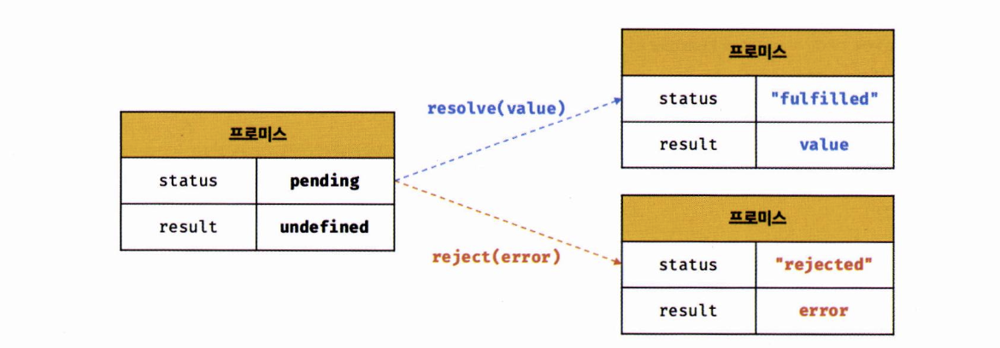

# 10주차 발표 자료

# 45장 프로미스

## 45.1 비동기 처리를 위한 콜백 패턴의 단점

### 45.1.1 콜백 헬

- 비동기 함수를 호출하면 함수 내부의 비동기로 동작하는 코드가 완료되지 않았다고 해도 기다리지 않고 즉시 종료된다.

```jsx
function first(callback) {
  let value;

  setTimeout(() => {
    value = { /*내용*/ };
    callback(null, value);
  }, 4000);
}

first(function callbackOne(error, value) {
  if (error) {
    // ErrorHandling
  } else {
    second(value, function callbackTwo(error, value) {
      if (error) {
        // ErrorHandling
      } else {
        third(value, function callbackThree(error, value) {
          if (error) {
            // ErrorHandling
          } else {
            console.log(
              `Final value is ${value}. Here is end of Callback hell...`
            );
          }
        });
      }
    });
  }
});
```

- 콜백 함수를 통해 비동기 함수의 결과를 처리하는 비동기 함수가 이를 통해 또다른 비동기 함수를 호출해야 한다면 콜백 함수의 중첩도가 높아진다. 이것을 콜백 헬이라고 한다.

## 45.2 프로미스의 생성

- 미래에 어떤 종류의 결과가 반환됨을 약속해주는 오브젝트

```jsx
const promise = new Promise((resolve, reject) => {
    if(/*비동기 처리 성공*/) {
        resolve('result');
    } else {
        reject('failure reason');
    }
})
```

- 콜백 함수를 인수로 전달받아 비동기 처리를 수행한다.



- pending : 결과를 기다리는 중
- fullfilled : 수행이 정상적으로 끝났고, 결과를 가지고 있음
- rejected : 수행이 비정상적으로 끝남

```jsx
const promiseGet = url => {
    return new Promise((resolve, reject) => {
        const xhr = new XMLHttpRequest();
        xhr.open('GET', url);
        xhr.send();

        xhr.onload = () => {
            if (xhr.status === 200) {
                resolve(JSON.parse(xhr.response));
            } else {
                reject(new Error(xhr.status));
            }
        }
    })
}

promiseGet('https://기타등등')
```

- promiseGet 함수는 내부에서 프로미스를 생성하고 프로미스를 반환한다.

## 45.3 프로미스의 후속 처리 메서드

### 45.3.1 Promise.prototype.then

then 메소드는 프로미스가 이행(fulfilled)되었을 때 실행되는 함수이고
함수를 첫 번째 인자로 받는데, 그 함수의 인자는 Promise의 성공 결과 값을 받는다

```jsx
const successPromise = new Promise(function (resolve, reject) {
  setTimeout(function () {
    resolve("Success");
  }, 3000);
});

successPromise.then(function (value) {
  console.log(value); // value인자가 결과 값 "Success"
});

successPromise.then((value) => console.log(value));
```

### 45.3.2 Promise.prototype.catch

catch 메소드는 프로미스가 거부(rejected)되었을 때 실행되는 함수이고
함수를 인자로 받는데, 그 함수의 인자는 여기서 거부 결과 값을 받는다

```jsx
const failurePromise = new Promise(function (resolve, reject) {
  setTimeout(function () {
    reject(new Error("Request is failed"));
  }, 3000);
});

failurePromise
  .then(function (value) { // 거부(실패)된 프로미스는 then 메소드를 통과 
    console.log(value);
  })
  .catch(function (error) {
    console.log(error); 
  });

failurePromise
  .then((value) => console.log(value))
  .catch((error) => console.log(error));
```

### 45.3.3 Promise.prototype.finally

finally는 Promise의 성공과 실패에 관계없이 처리만 되면 실행되는 함수
따라서 finally에선 프로미스가 성공되었는지, 실패되었는지 알 수 없다.

```jsx
const successPromise = new Promise((resolve, reject) => {
  setTimeout(function () {
    resolve("Success");
  }, 3000);
});

successPromise
  .then((value) => `${value} is`)
  .then((secondValue) => {
    throw new Error("Error!!");
  }) // 에러 발생
  .then((thirdValue) => console.log("possible"))
  .catch((error) => {
    console.log(error);
  })
  .finally(() => console.log("chain end"));
```

- 위 Promise상태가 어떻든 간에 Promise 객체가 반환되었기 때문에 finally 메소드가 무조건적으로 실행된다

## 45.5 프로미스 체이닝

```jsx
new Promise(function(resolve, reject) {
    setTimeout(() => resolve(1), 100)
}).then(result -> {
    alert(result)
    return result + 2
}).then(result -> {
    alert(result)
    return result + 2
}).then(result -> {
    alert(result)
    return result + 2
})
```

- 여러개의 프로미스를 연결하는 것
- then() 메소드를 한 번 호출하고 나면 새로운 프로미스 객체가 반환된다는 특징을 이용
- 가독성

## 45.6 프로미스의 정적 메서드

### 45.6.1 Promise.resolve / Promise.reject

```jsx
const promise = Promise.resolve('success') // new Promise(resolve => resolve('success'))
promise.then(message => console.log(message)) // success

const promise = Promise.reject('failed') // new Promise((resolve, reject) => reject('failed'))
promise.catch(error => console.log(error)) // failed
```

- resolve, reject 메소드는 인자값을 래핑하여 프로미스를 반환한다.

### 45.6.2 Promise.all

```jsx
const promise1 = () => new Promise(resolve => setTimeout(() => resolve(1), 1000))
const promise2 = () => new Promise(resolve => setTimeout(() => resolve(2), 2000))
const promise3 = () => new Promise(resolve => setTimeout(() => resolve(3), 3000))

promise1().then(result => {
    console.log(result) // 프로그램을 실행하고 1초뒤에 수행됨
    return promise2()
}).then(result => {
    console.log(result) // 프로그램을 실행하고 3초뒤에 수행됨 (1 + 2)
    return promise3()
}).then(result => {
    console.log(result) // 프로그램을 실행하고 6초뒤에 수행됨 (1 + 2 + 3)
})
```
1
2
3
```

- 프로미스가 담겨있는 배열과 같은 이터러블 객체를 인자로 받는다.
- 첫번째 프로미스가 실행 완료된 후에 두번째 프로미스가 실행되어야 한다면 이를 순차적으로 처리해야 하지만, 서로 의존성이 없으면 순차적으로 처리할 필요가 없다
- 서로 의존관계이지 않은 여러 프로미스들을 이터러블 객체에 담아 Promise.all 메소드를 이용해 한 번에 병렬처리한다

```jsx
Promise.all([
    new Promise(resolve => setTimeout(() => resolve(1), 1000)),
    new Promise(resolve => setTimeout(() => resolve(2), 2000)),
    new Promise(resolve => setTimeout(() => resolve(3), 3000))
]).then(console.log) // 프로그램을 실행하고 3초뒤에 실행됨
.catch(console.log)

// 결과: [ 1, 2, 3 ]
```

### 45.6.3 Promise.race

```jsx
Promise.race([
    new Promise(resolve => setTimeout(() => resolve(1), 1000)),
    new Promise(resolve => setTimeout(() => resolve(2), 2000)),
    new Promise(resolve => setTimeout(() => resolve(3), 3000))
]).then(console.log) 
.catch(console.log)

// 결과: 1
```

- Promise.all과 달리 가장 먼저 끝나는 프로미스의 결과값만 resolve로 반환한다.

### 45.6.4 Promise.allSettled

```jsx
Promise.allSettled([
    new Promise(resolve => setTimeout(() => resolve(1), 1000)),
    new Promise((resolve, reject) => setTimeout(() => reject(2), 2000))
]).then(console.log)
```
```
[
  { status: 'fulfilled', value: 1 },
  { status: 'rejected', reason: 2 }
]
```

- Promise.all은 프로미스를 수행하던 도중 하나라도 rejected가 발생하면 rejected 상태로 변환하고 종료하는데, Promise.allSettled 메소드를 사용하면 reject 상태가 되어도 수행을 종료하지 않고, 프로미스가 수행된 상태와 결과값을 배열에 담아 resolve로 변환한다.