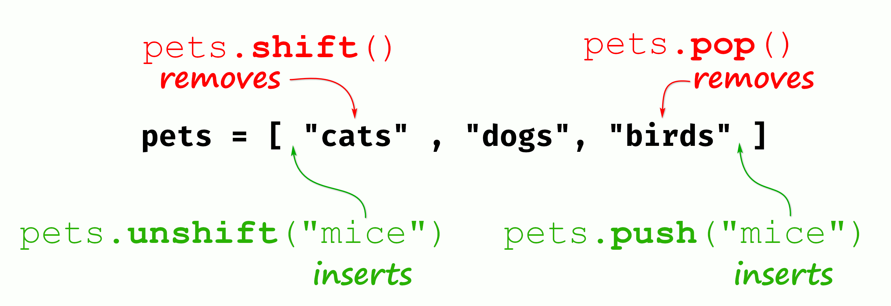
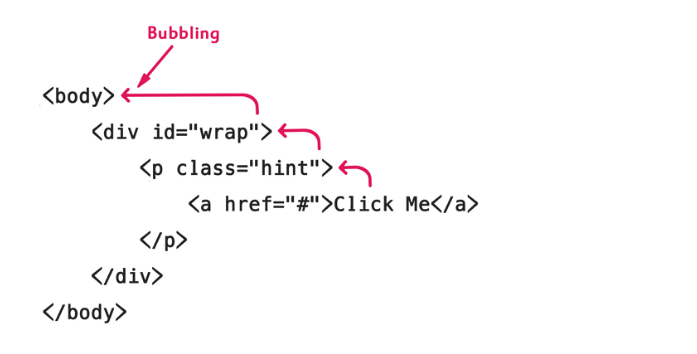

# 9주차 발표 자료

# 38장 브라우저의 렌더링 과정

- Parsing
  - 프로그래밍 언어의 문법에 맞게 작성된 텍스트 문서를 읽어 들여 실행하기 위해 
  - 텍스트 문서의 문자열을 토큰으로 분해하고, 
  - 토큰에 문법적 의미와 구조를 반영하여 트리 구조의 자료구조를 생성하는 일련의 과정을 말한다.
- 렌더링
    - HTML, CSS, JavaScript로 작성된 문서를 파싱하여 브라우저에 시각적으로 출력하는 것을 말한다.

## 38.1 요청과 응답

- 브라우저는 필요한 리소스를 서버에 요청하고, 서버로부터 응답받아 브라우저에 시각적으로 렌더링한다.
- 서버에 요청을 전송하기 위해 브라우저는 주소창을 제공한다.

## 38.2 HTTP 1.1과 HTTP 2.0

- HTTP는 웹에서 브라우저와 서버가 통신하기 위한 프로토콜이다.

- HTTP 1.1 : 커넥션당 하나의 요청과 응답만 처리한다. 여러 개의 요청을 한 번에 전송할 수 없고 응답 또한 마찬가지다.
- HTTP 2.0 : 커넥션당 여러 개의 요청과 응답이 가능하다. 여러 리소스의 동시 전송이 가능하다.

## 38.3 HTML 파싱과 DOM 생성

- 브라우저의 요청에 의해 서버가 응답한 HTML 문서는 문자열로 이루어진 순수한 텍스트다.
- 이 텍스트를 시각적인 픽셀로 렌더링하려면 HTML 문서를 브라우저가 이해할 수 있는 자료구조로 변환하여 메모리에 저장해야 한다.

1. 서버에 존재하는 HTML 파일이 응답된다. HTML 파일을 읽어 들여 메모리에 저장한 다음 메모리에 저장된 바이트를 인터넷을 경유하여 응답한다.
2. 브라우저는 서버가 응답한 HTML 문서를 바이트 형태로 응답받는다. 그리고 문자열로 변환한다.
3. 문자열로 변환된 HTML 문서를 읽어 문법적 의미를 갖는 코드의 최소 단위인 토큰들로 분해한다.
4. 각 토큰들을 객체로 변환하여 노드들을 생성한다.
5. HTML 요소 간에는 중첩 관계가 생기는데, 이것을 반영하여 트리 자료구조로 구성한다.

- 이렇게 구성된 트리 자료구조를 DOM(Document Object Model)이라 부른다.

## 38.4 CSS 파싱과 CSSOM 생성

- 렌더링 엔진은 HTML을 한 줄씩 파싱하며 DOM을 생성해가다가, CSS를 로드하는 링크나 스타일 태그를 만나면 DOM 생성을 일시 중단한다.
- 그리고 CSS 파일을 서버에 요청하여 로드한 CSS 파일이나 style 태그 내의 CSS를 HTML과 동일한 파싱 과정을 통해 CSSOM을 생성한다.

## 38.5 렌더 트리 생성

- DOM과 CSSOM은 렌더링을 위해 렌더 트리로 결합된다.
- 렌더 트리는 브라우저 화면에 렌더링되는 노드만으로 구성된다.

## 38.6 자바스크립트 파싱과 실행

- DOM은 HTML 문서의 구조와 정보뿐만 아니라 HTML 요소와 스타일 등을 변경할 수 있는 프로그래밍 인터페이스로서 DOM API를 제공한다. = 이미 생성된 DOM을 동적으로 조작할 수 있다.
- script문 또한 css처럼, DOM 생성 중에 script를 만나면 DOM 생성을 중단하고 script문 해석을 진행하게 된다.

#### 토크나이징

- 자바스크립트 소스코드를 어휘 분석하여 문법적 의미를 갖는 코드의 최소 단위인 토큰들로 분해한다.

#### 파싱

- 토큰들의 집합을 구문 분석하여 추상적 구문 트리(AST)를 생성한다.

#### 바이트코드 생성과 실행

- 파싱의 결과물로 생성된 AST는 바이트코드로 변환되고 인터프리터에 의해 실행된다.

## 38.7 리플로우와 리페인트

- 자바스크립트로 인해 DOM API가 사용되어 DOM/CSSOM이 변경될 경우, DOM/CSSOM은 다시 렌더 트리로 결합된다.
- 변경된 렌더 트리를 기반으로 리플로우, 리페인트를 통해 다시 브라우저 화면에 렌더링된다.

## 38.8 자바스크립트 파싱에 의한 HTML 파싱 중단

- 스크립트 코드 발견으로 HTML 파싱 중단이 될 경우, 만약 스크립트 코드에서 DOM API 사용으로 아직 DOM이 생성되지 않은 곳을 수정하려는 작업을 진행한다면 문제가 발생할 것이다.
- 이러한 문제를 발생시키지 않게 하기 위해 body 요소의 가장 아래에 자바스크립트를 위치시키는 것이 좋다.

## 38.9 script 태그의 async/defer 어트리뷰트

- 위 문제를 근본적으로 해결하기 위해 async/defer 어트리뷰트가 추가됨

#### async 어트리뷰트

- HTML 파싱과 외부 자바스크립트 파일의 로드가 비동기적으로 동시에 진행된다.
- 자바스크립트의 파싱과 실행은 자바스크립트 파일의 로드가 완료된 직후 진행되며, 이 때 HTML 파싱이 중단된다.

#### defer 어트리뷰트

- HTML 파싱과 외부 자바스크립트 파일의 로드가 비동기적으로 동시에 진행된다.
- 자바스크립트의 파싱과 실행은 HTML 파싱이 전부 완료되고 DOM 생성이 완료된 직후에 진행된다. 